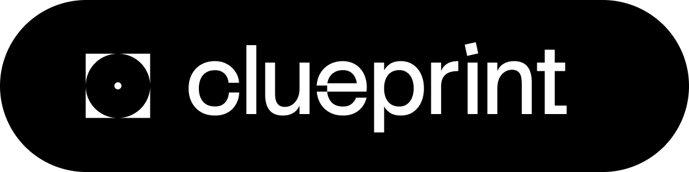

<p align="center">
  
</p>

<p align="center">
  <a href="https://www.npmjs.com/package/clueprint"></a>
  <a href="https://www.npmjs.com/package/clueprint"></a>
  <a href="LICENSE"></a>
</p>

<p align="center">
  Give your AI coding assistant eyes on the browser.<br/>
  Select elements, capture regions, record flows — all visible to Claude via MCP.
</p>

---

## Install

```bash
npx clueprint setup
```

The setup wizard builds the Chrome extension, configures the MCP server, and connects everything to Claude Code. Follow the on-screen instructions to load the extension.

## What it does

Instead of describing what you see or copy-pasting HTML, clueprint lets your AI assistant observe the browser directly:

| Action                      | What gets captured                                                                |
| --------------------------- | --------------------------------------------------------------------------------- |
| **Option+Click** an element | Tag, classes, attributes, computed styles, parent context, related console errors |
| **Cmd+Shift+Drag** a region | Screenshot, all elements within bounds, DOM structure, visual analysis            |
| **Record a flow**           | Clicks, scrolls, inputs, network requests, console errors, layout shifts          |
| **Run an audit**            | Console errors, network failures, performance metrics, accessibility issues       |

All data flows through [MCP](https://modelcontextprotocol.io) so any compatible assistant can access it.

## How it works

```
┌─────────────┐       WebSocket       ┌────────────┐       MCP        ┌─────────────┐
│   Chrome    │ ◄──────────────────► │  MCP       │ ◄──────────────► │  Claude     │
│  Extension  │                       │  Server    │                   │  Code       │
└─────────────┘                       └────────────┘                   └─────────────┘
 Captures DOM,                         Exposes tools                    Calls tools to
 styles, network,                      for browser                      understand what
 console, screenshots                  visibility                       you're seeing
```

## CLI

```bash
npx clueprint setup    # build extension + configure MCP
npx clueprint status   # check installation health
npx clueprint start    # start MCP server manually
```

## Manual setup

<details>
<summary>If you prefer to configure things yourself</summary>

### Build

```bash
pnpm install && pnpm run build
```

### Load the extension

1. Open `chrome://extensions/`
2. Enable **Developer mode**
3. Click **Load unpacked** → select `packages/chrome-extension/dist`

### Configure MCP

Add to your Claude Code MCP config:

```json
{
  "mcpServers": {
    "clueprint": {
      "command": "node",
      "args": ["/path/to/clueprint/packages/mcp-server/dist/index.js"]
    }
  }
}
```

</details>

## Development

```bash
# Watch extension
cd packages/chrome-extension && pnpm run watch

# Watch MCP server
cd packages/mcp-server && pnpm run dev
```

## Requirements

- Node.js 18+
- Chrome
- Claude Code (or any MCP-compatible assistant)

## License

MIT
